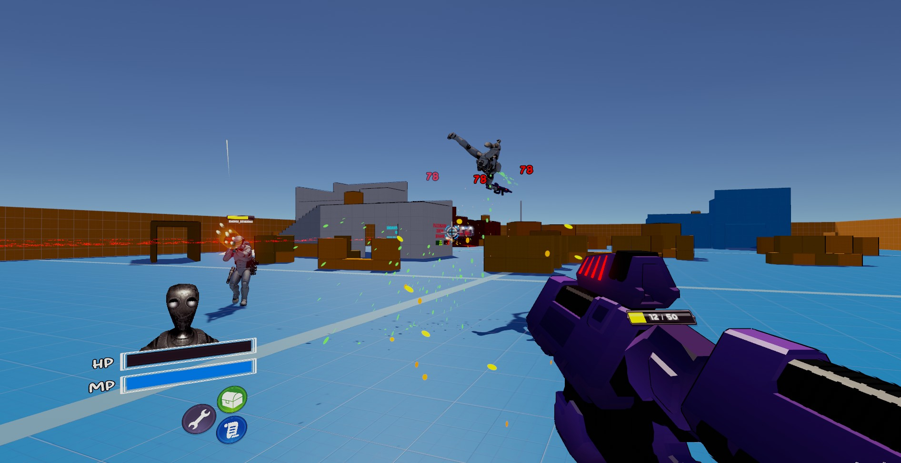
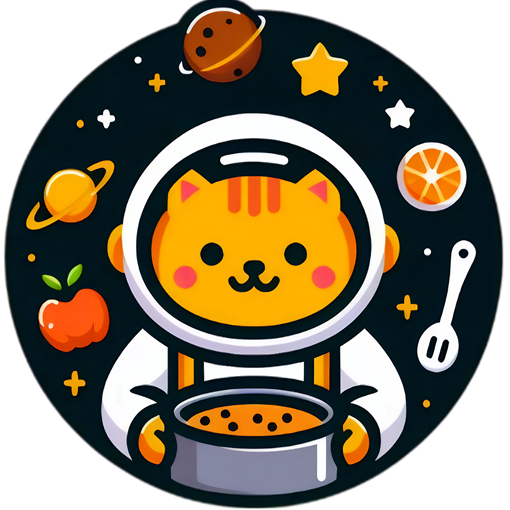
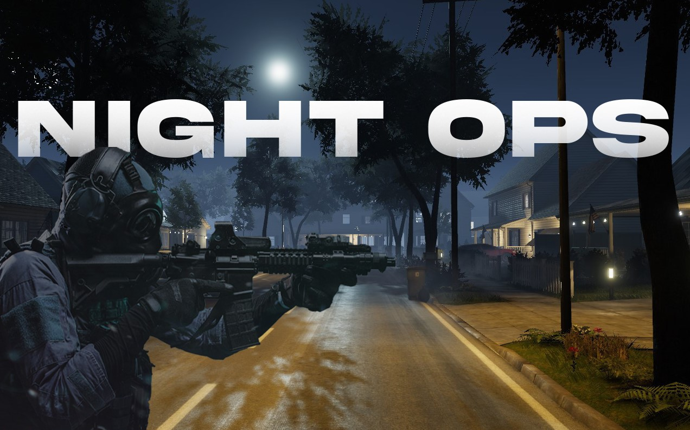

## About Me

    

        
        

    

Hi there, I’m Brandon Withington! I am an Extended Reality (XR) Software Engineer with over 3 years of experience developing immersive standalone game worlds and interactive experiences with the Unity engine. I am proficient in object-oriented programming languages including C# and Python, I have a deep passion for learning and innovation in game development and virtual reality. I am known for my self-motivation, enthusiasm, and dedication. I strive to craft compelling gameplay and unforgettable moments through creative solutions and story telling through the medium of code!

---

## Skills

- **Game Engines:** Unity, Unreal Engine
- **Programming Languages:** C#, C++, Lua, OpenGL, Python, GDScript
- **3D Modeling & Animation:** Blender, Maya, Substance Painter
- **Version Control:** Git, Perforce
- **Other Tools:** Visual Studio, JetBrains Rider, Adobe Photoshop

---

## Project Overview

Here are some of the projects I've worked on. Click on a project to learn more:

    

        <a href="{{ site.baseurl }}/projects/Delta-Quest">
            
            
Delta-Quest

        </a>
    

    

        <a href="{{ site.baseurl }}/projects/MiniPutt">
            
            
Miniputt Park VR & Desktop Game

        </a>
    

    

        <a href="{{ site.baseurl }}/projects/Industrial-Go-Karts">
            
            
Industrial Go-Kart Racing

        </a>
    

        

        <a href="{{ site.baseurl }}/projects/Space-Diner">
            
            
Momo's Space Diner

        </a>
    

    

        <a href="{{ site.baseurl }}/projects/Night-Ops">
            
            
Neighborhood Night Ops

        </a>
    

    <!-- Add more projects as needed -->

---

## Contact Me

If you'd like to get in touch, feel free to contact me!

- [<i class="fas fa-envelope" style="color: black;"></i> Send me an Email!](mailto:brandon.f.withington@gmail.com){:target="_blank" rel="noopener noreferrer"}
- [<i class="fab fa-linkedin" style="color: black;"></i> My Linkedin Profile](https://www.linkedin.com/in/brandon-withington/){:target="_blank" rel="noopener noreferrer"}
- [<i class="fab fa-github" style="color: black;"></i> My GitHub Profile](https://github.com/BrandonW24){:target="_blank" rel="noopener noreferrer"}

---

<link rel="stylesheet" href="https://cdnjs.cloudflare.com/ajax/libs/font-awesome/6.0.0-beta3/css/all.min.css">