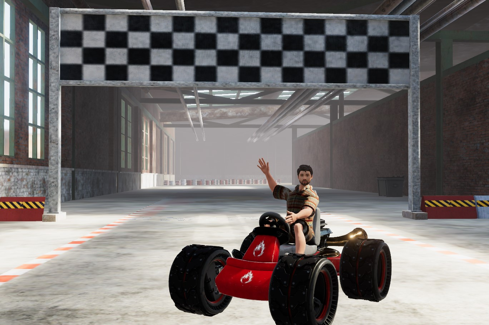

## About Me

Hi there! I’m Brandon Withington! I am an Extended Reality (XR) Software Engineer with over 3 years of experience developing immersive standalone game worlds and interactive experiences with the Unity engine. I am proficient in object-oriented programming languages including C# and Python, I have a deep passion for learning and innovation in game development and virtual reality. I am known for my self-motivation, enthusiasm, and dedication. I strive to craft compelling gameplay and unforgettable moments through creative solutions and story telling through the medium of code!

This site is very much still under construction at this moment!
---

## Project Overview

Here are some of the projects I've worked on. Click on a project to learn more:

    

        <a href="{{ site.baseurl }}/projects/project1">
            
            
Project Title 1

        </a>
    

    

        <a href="{{ site.baseurl }}/projects/project2">
            
            
Project Title 2

        </a>
    

    

        <a href="{{ site.baseurl }}/projects/project3">
            
            
Project Title 3

        </a>
    

    <!-- Add more projects as needed -->

## Skills

- **Game Engines:** Unity, Unreal Engine
- **Programming Languages:** C#, C++, Lua, OpenGL, Python, GDScript
- **3D Modeling & Animation:** Blender, Maya, Substance Painter
- **Version Control:** Git, Perforce
- **Other Tools:** Visual Studio, JetBrains Rider, Adobe Photoshop

---

## Contact Me

If you'd like to get in touch, feel free to reach out via:

- **Email:** [brandon.f.withington@gmail.com](mailto:brandon.f.withington@gmail.com)
- **LinkedIn:** [My Linkedin Profile](https://www.linkedin.com/in/brandon-withington/)
- **GitHub:** [My GitHub Profile](https://github.com/BrandonW24)

---

Thank you for visiting my portfolio! I look forward to connecting with you.